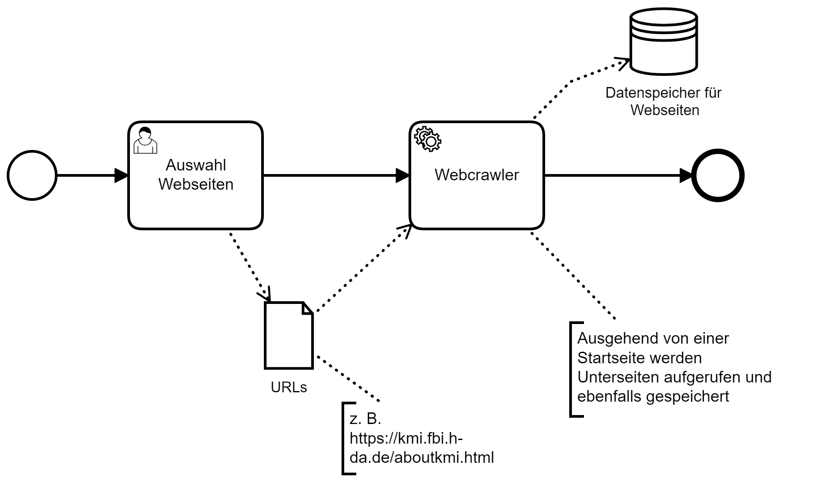

# Webcrawler
The webcrawler extracts paragraphs from the target websites which can be used for question generation later on. Each distinct website is saved on an elasticsearch index for the given url. The name of the index and start URL are parameters for the crawler (see [Start the crawler from CLI](#Start-the-crawler-from-CLI)). 

## Webpage to text test

|Task| |
|---|---|
|Webpage to text test| |

## Install
Install all with

`pip install -r requirements.txt`

Scrapy, a fast high-level web crawling & scraping framework for Python https://github.com/scrapy/scrapy

`pip install scrapy==2.5.1`

Splash is a "Lightweight, scriptable browser as a service with an HTTP API" https://github.com/scrapinghub/splash

`pip install scrapy_splash==0.8.0`

Free and Open, Distributed, RESTful Search Engine https://github.com/elastic/elasticsearch

`pip install elasticsearch==7.17.0`

Heuristic based boilerplate removal tool https://github.com/miso-belica/jusText

`pip install justext==3.0.0`

### Install & run splash and Elasticsearch

`docker-compose up`

or

`docker-compose -p "webcrawler" up`

Elasticsearch server: http://localhost:9200/

Splash frontend: http://localhost:8050/

Recommended frontend for elasticsearch (browser extension): https://elasticvue.com/

## Start the crawler from CLI
The webcrawler can be started from CLI.

Options
* -s: Settings
* -a: Arguments
* -o: Output

`scrapy crawl intent-finder-bot -s ELASTICSEARCH_INDEX=test -a start_url='https://kmi.fbi.h-da.de/aboutkmi.html' -o test.json`

## Test URLs

### No JavaScript content
https://kmi.fbi.h-da.de/aboutkmi.html

https://www.rki.de/DE/Home/homepage_node.html

https://www.dge.de/wissenschaft/faqs/

https://quotes.toscrape.com/

https://books.toscrape.com/

### JavaScript content
http://www.webscrapingfordatascience.com/simplejavascript/

https://quotes.toscrape.com/js/

### Known problems
- Cookie banner content is scraped. 
- If content is rendered after mandatory user interaction it isn't scraped e. g. the cookie banner has to be accepted for content to render.

## Further possible improvements
- Run spiders on scrapyd (scrapy daemon service) for maintainability, monitoring and scalability https://scrapyd.readthedocs.io/en/stable/