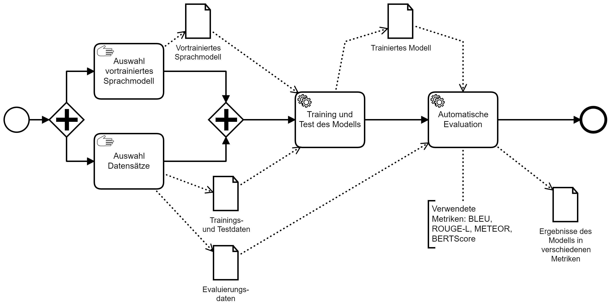

# Transformer finetuning for text-to-text tasks

This folder contains all training scripts to finetune a mT5 model. One already trained model is provided via huggingface https://huggingface.co/tilomichel/mT5-base-GermanQuAD-e2e-qg

|Task| |
|---|---|
|Training notebook|[](https://colab.research.google.com/github/TiloMichel/textgen-for-chatbot-training-german/blob/main/2_training/mT5_training_text2text.ipynb) |



## Model selection
Primarily, models from Google's T5 family ([T5](https://arxiv.org/abs/1910.10683), [mt5](https://aclanthology.org/2021.naacl-main.41/)) were used, as they are easy to use for text-to-text tasks. T5 models are similar to the original Transformer architecture in that they use encoder and decoder blocks.

In addition, other works/projects already used T5 to accomplish various NLP tasks (e.g. question generation or paraphrasing) for English, a few examples:
* https://github.com/patil-suraj/question_generation / https://huggingface.co/valhalla/t5-base-e2e-qg
* https://github.com/Vamsi995/Paraphrase-Generator / https://huggingface.co/Vamsi/T5_Paraphrase_Paws
* https://github.com/PrithivirajDamodaran/Parrot_Paraphraser / https://huggingface.co/prithivida/parrot_paraphraser_on_T5

In general, sequence-to-sequence (T5) and autoregressive (GPT) models are suitable for text generation or text-to-text generation. 

## Config preperation for training
With a configuration file, the parameters of the training can be easily defined in JSON format. The configuration file includes ModelArguments, DataTrainingArguments (see run_text2text.py) and [TrainingArguments](https://huggingface.co/docs/transformers/main/en/main_classes/trainer#transformers.TrainingArguments). All parameters are explained in the script or in the Huggingface documentation. An example configuration looks like the following:
```js
{
    "model_name_or_path": "google/mt5-base",
    "output_dir": "/home/smebt/Projekte/mt5-base-qa-qg-ae",
    "overwrite_output_dir": true,
    "cache_dir": "/home/smebt/Projekte/model-cache",
    "dataset_dir": "/home/smebt/Projekte/datasets/qa_qg_ae_dataset",
    "preprocessing_num_workers": 20,
    "max_source_length": 1024,
    "max_target_length": 128,
    "val_max_target_length": 128,
    "pad_to_max_length": true,
    "num_beams": 4,
    "wandb_project": "mt5_qa_qg_ae",
    "seed": 42,
    "do_train": true,
    "do_eval": true,
    "predict_with_generate": true,
    "gradient_accumulation_steps": 16,
    "per_device_train_batch_size": 4,
    "per_device_eval_batch_size": 4,
    "optim": "adafactor",
    "learning_rate": 1e-4,
    "num_train_epochs": 10,
    "evaluation_strategy": "epoch",
    "logging_strategy": "epoch",
    "report_to": "wandb",
    "run_name": "mt5-base-germanquad-qa-qg-ae",
    "save_strategy": "epoch",
    "save_total_limit": 3,
    "dataloader_num_workers": 8,
    "ddp_find_unused_parameters": false
}
```

Collecting metrics on test data and reporting to [wandb](https://wandb.ai/) is currently commented out in the run_text2text.py script.

## Training
If the data is in an Arrow dataset and a configuration has been created for training, the training script can be run as follows.

Training with a GPU

`python run_text2text.py configs/mt5-qa-qg-ae-germanquad.json`

Training with multiple GPUs and [torchrun](https://pytorch.org/docs/stable/elastic/run.html)

`torchrun --nnode=1 --nproc_per_node=2 run_text2text.py configs/mt5-qa-qg-ae-germanquad.json`
