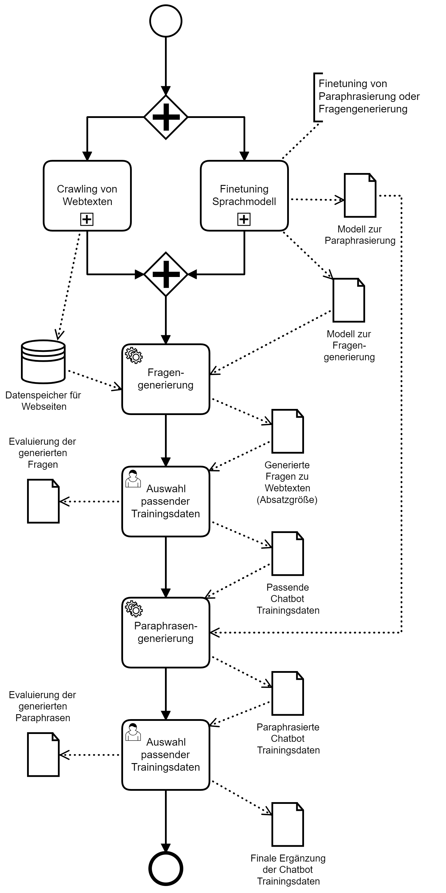

# Text generation for chatbot training in German
This repository contains experiments to perform text generation for chatbots in German.

The code is part of a master thesis which can be obtained upon request (e-mail on my [github profile](https://github.com/TiloMichel)). 

It was tried to store all necessary information about the code in the repository in README files or in the code itself. If there are any unclear places, an issue can be created.

## Folder content
The folder structure represents the pipeline to generate texts for chatbot training from websites. It is also possible to generate paraphrases with two different techniques.

| Folder | Content description |
|---|---|
| [0_webcrawler](0_webcrawler) | All code related to text extraction from a website |
| [1_data_preparation_and_exploration](1_data_preparation_and_exploration) | Code for data preparation and exploration is provided, especially for question generation and paraphrasing |
| [2_training](2_training) | All necessary code to finetuning a transformer model for question generation or paraphrasing |
| [3_evaluation](3_evaluation) | Code for model evaluation with metrics |
| [4_inference](4_inference) | Scripts to generate outputs in spreadsheet form with different models (for manual evaluation) |
| [4_inference/results](4_inference/results) | Measured metrics and manual evaluation |

## Pipeline overview
The following [BPMN 2.0](http://www.bpmb.de/images/BPMN2_0_Poster_DE.pdf) diagram shows all steps to perform (German):

## References (WIP to be extended)

### Question generation
* Question generation using 🤗transformers https://github.com/patil-suraj/question_generation
* MixQG: Neural Question Generation with Mixed Answer Types https://github.com/salesforce/QGen/tree/main/MixQG
* Turkish Question Generation https://github.com/obss/turkish-question-generation

### Paraphrasing
* Parrot https://github.com/PrithivirajDamodaran/Parrot_Paraphraser
* Paraphrase Generator with T5 https://github.com/Vamsi995/Paraphrase-Generator
* Paraphrase any question with T5 (Text-To-Text Transfer Transformer) - Pretrained model and training script provided https://github.com/ramsrigouthamg/Paraphrase-any-question-with-T5-Text-To-Text-Transfer-Transformer-
* Automated Paraphrasing Tool https://github.com/AudayBerro/automatedParaphrase
* A Visual Survey of Data Augmentation in NLP https://amitness.com/2020/05/data-augmentation-for-nlp/

### Metrics
* BLEU https://aclanthology.org/P02-1040/
* ROUGE-L https://aclanthology.org/W04-1013/
* METEOR https://aclanthology.org/W05-0909/ , https://www.cs.cmu.edu/~alavie/METEOR/
* BERTScore https://github.com/Tiiiger/bert_score